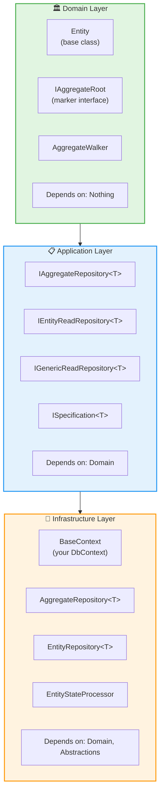

# 📚 PersistenceToolkit — DDD-Friendly Persistence Orchestration

---

## 🚀 What is PersistenceToolkit?

**PersistenceToolkit** is your reusable, modular orchestration layer for **safe, consistent, Domain-Driven Design (DDD)-first persistence** with **EF Core**.

It gives you:

✅ True aggregate root boundaries  
✅ Smart state management & tracking  
✅ Clean separation of read/write responsibilities  
✅ Soft deletes, tenant isolation, and audit logging — all automated  
✅ Full snapshot-based change detection  
✅ Navigation ignore rules for safe partial updates  
✅ Consistent detach after save — zero stale tracking

It turns plain EF Core into a **domain-safe store**.

---

## 👥 Who Should Use This?

**PersistenceToolkit** is ideal for:

- ✅ **DDD Practitioners** — Teams building domain-driven applications who need aggregate root enforcement
- ✅ **Multi-tenant Applications** — Systems requiring automatic tenant isolation and audit logging
- ✅ **Enterprise Applications** — Projects needing consistent state management, soft deletes, and change tracking
- ✅ **Clean Architecture Teams** — Developers following layered architecture who want to keep `DbContext` out of application/domain layers
- ✅ **EF Core Users** — Teams using Entity Framework Core who want safer, more predictable persistence behavior
- ✅ **Teams with Complex Aggregates** — Applications with nested entity graphs that need whole-aggregate persistence

**Not ideal for:**
- ❌ Simple CRUD applications without DDD requirements
- ❌ Projects that don't use Entity Framework Core
- ❌ Applications that need direct `DbContext` access in business logic

---

## 📋 Prerequisites

Before integrating PersistenceToolkit, ensure you have:

- **.NET 6.0**, **.NET 8.0**, or **.NET 9.0**
- **Entity Framework Core** (version 6.0.33+ for .NET 6.0, 8.0.11+ for .NET 8.0, or 9.0.7+ for .NET 9.0)
- **SQL Server** (or compatible database via EF Core provider)
- A **layered architecture** with separate Domain, Application, and Infrastructure layers
- Understanding of **Domain-Driven Design (DDD)** concepts, especially aggregate roots

---

## 📦 Installation

### Via NuGet

Install the required packages based on your layer:

```bash
# For Domain layer
dotnet add package PersistenceToolkit.Domain

# For Application layer
dotnet add package PersistenceToolkit.Abstractions

# For Infrastructure layer
dotnet add package PersistenceToolkit
```

### Package References

```xml
<ItemGroup>
  <PackageReference Include="PersistenceToolkit.Domain" Version="10.0.2" />
  <PackageReference Include="PersistenceToolkit.Abstractions" Version="10.0.2" />
  <PackageReference Include="PersistenceToolkit" Version="10.0.2" />
</ItemGroup>
```

---

## 🚀 Quick Start / Integration Guide

### Step 1: Implement `ISystemUser`

Create an implementation of `ISystemUser` to provide current user and tenant context:

```csharp
public class SystemUser : ISystemUser
{
    public int UserId { get; set; }
    public int TenantId { get; set; }
}
```

### Step 2: Create Your DbContext

Inherit from `BaseContext` and implement required methods:

```csharp
public class MyDbContext : BaseContext
{
    public MyDbContext(DbContextOptions<BaseContext> options) : base(options) { }
    
    public MyDbContext(string connectionString) : base(connectionString) { }
    
    public DbSet<MyAggregate> MyAggregates { get; set; }
    
    protected override void ApplyConfiguration(ModelBuilder modelBuilder)
    {
        // Apply your entity configurations
        modelBuilder.ApplyConfiguration(new MyAggregateConfiguration());
    }
    
    protected override void DefineManualConfiguration(ModelBuilder modelBuilder)
    {
        // Define any manual configurations
        // Optionally mark navigation properties to ignore on update:
        // modelBuilder.Entity<MyAggregate>()
        //     .IgnoreOnUpdate(x => x.SomeNavigationProperty);
    }
}
```

### Step 3: Define Your Domain Entities

Your entities must inherit from `Entity`:

```csharp
public class MyAggregate : Entity, IAggregateRoot
{
    public string Name { get; set; }
    public virtual ICollection<ChildEntity> Children { get; set; }
}

public class ChildEntity : Entity
{
    public int MyAggregateId { get; set; }
    public string Title { get; set; }
}
```

### Step 4: Register Services

In your `Program.cs` or `Startup.cs`:

```csharp
using PersistenceToolkit.Persistence;
using PersistenceToolkit.Abstractions;

var builder = WebApplication.CreateBuilder(args);

// Register your DbContext
builder.Services.AddScoped<BaseContext>(serviceProvider =>
{
    var connectionString = builder.Configuration.GetConnectionString("DefaultConnection");
    return new MyDbContext(connectionString);
});

// Register ISystemUser (implement based on your auth system)
builder.Services.AddScoped<ISystemUser>(serviceProvider =>
{
    // Example: Get from current HTTP context, claims, etc.
    var httpContext = serviceProvider.GetRequiredService<IHttpContextAccessor>().HttpContext;
    return new SystemUser 
    { 
        UserId = GetUserIdFromContext(httpContext),
        TenantId = GetTenantIdFromContext(httpContext)
    };
});

// Register PersistenceToolkit repositories
builder.Services.AddPersistenceToolkit();

var app = builder.Build();
```

### Step 5: Use Repositories in Your Application Layer

```csharp
public class MyApplicationService
{
    private readonly IAggregateRepository<MyAggregate> _repository;
    
    public MyApplicationService(IAggregateRepository<MyAggregate> repository)
    {
        _repository = repository;
    }
    
    public async Task<MyAggregate> CreateAggregateAsync(string name)
    {
        var aggregate = new MyAggregate { Name = name };
        await _repository.Save(aggregate);
        return aggregate;
    }
    
    public async Task<MyAggregate?> GetByIdAsync(int id)
    {
        return await _repository.GetByIdAsync(id);
    }
    
    public async Task<PaginatedResult<MyAggregate>> SearchAsync(string searchTerm)
    {
        var spec = new Specification<MyAggregate>()
            .Where(x => x.Name.Contains(searchTerm))
            .OrderBy(x => x.Name)
            .Take(10);
            
        return await _repository.GetPaginatedAsync(spec);
    }
}
```

---

## 🎯 The main goal

PersistenceToolkit’s main goal is to **encapsulate all EF Core behavior behind proper DDD guardrails**, so:
- Your **Domain** layer stays pure.
- Your **Application** layer depends only on clean repository contracts — never `DbContext`.
- Your **Infrastructure** handles orchestration, specs, audit logic, and tracking rules.
- Your aggregates are always saved **as a whole**, with no orphaned child updates.

---

## 🗂️ Project structure

| Package | What it does | Used by |
|---------|---------------|---------|
| **PersistenceToolkit.Domain** | `Entity`, `IAggregateRoot`, `AggregateWalker` | Domain only |
| **PersistenceToolkit.Abstractions** | `IAggregateRepository<T>`, `IEntityRepository<T>`, `IGenericRepository<T>`, `ISystemUser`, `BaseSpecification<T>` | Application |
| **PersistenceToolkit.Persistence** | EF Core implementations: `BaseContext`, `EntityStateProcessor`, `NavigationIgnoreTracker`, config extensions, repositories | Infrastructure |

---

## ✅ Key features that make this DDD-safe

---

### 🟢 1️⃣ Aggregate root enforcement

Your `IAggregateRepository<T>`:
- Works only with `where T : Entity, IAggregateRoot`.
- Enforces that you **never persist a child entity in isolation**.
- You must go through the aggregate root — always.

✅ Compile-time safety for your domain model.

---

### 🟢 2️⃣ Smart EntityStateProcessor

**Your orchestration brain:**
- Uses `HasChange()` snapshot comparison.
- Walks the entire aggregate graph recursively.
- Sets `Added` or `Modified` correctly.
- Skips navigations flagged with `.IgnoreOnUpdate()` via `NavigationIgnoreTracker`.
- Calls `EntityAuditLogSetter` to apply `TenantId`, `CreatedBy`, `UpdatedBy` on each node.
- Detaches all tracked entries after `SaveChanges`.

✅ EF Core never leaves stale tracked entities hanging in memory.

---

### 🟢 3️⃣ Graph traversal done right

Your `AggregateWalker`:
- Walks your root and all nested children.
- Runs any action you want — snapshotting, audit, state setting.
- Prevents missing nested entities when persisting.

---

### 🟢 4️⃣ Detect changes with snapshots

Your `Entity` base:
- Automatically snapshots state when loaded.
- Uses `HasChange()` before update.
- Your `DetectChange` method generates a detailed diff of **which properties changed**, with old & new values.
- Works across the entire graph.

✅ Makes your audit logs bulletproof.

---

### 🟢 5️⃣ Navigation ignore support

You can safely **exclude** nav properties from updates:

```csharp
// In your BaseContext.DefineManualConfiguration method
protected override void DefineManualConfiguration(ModelBuilder modelBuilder)
{
    modelBuilder.Entity<MyAggregate>()
        .IgnoreOnUpdate(x => x.SomeNavigationProperty);
}
```

This ensures that when updating an aggregate, the specified navigation properties are not touched, preventing unintended side effects.

---

## 🏗️ Architecture Layers & Dependencies

PersistenceToolkit follows Clean Architecture principles with clear layer separation:



**Key Rules:**
- ✅ Domain has **zero dependencies** on persistence
- ✅ Application depends only on **abstractions**, never implementations
- ✅ Infrastructure implements all persistence concerns
- ✅ Your business logic **never** references `DbContext` directly

---

## 📚 Repository Types

PersistenceToolkit provides three repository interfaces for different use cases:

### 1. `IAggregateRepository<T>` — For Aggregate Roots

**Use when:** You need to save/update/delete aggregate roots with their entire graph.

```csharp
public interface IAggregateRepository<T> where T : Entity, IAggregateRoot
{
    // Read operations
    Task<T?> GetByIdAsync(int id);
    Task<PaginatedResult<T>> GetPaginatedAsync(ISpecification<T> spec);
    Task<List<T>> GetListAsync(ISpecification<T> spec);
    
    // Write operations
    Task<bool> Save(T entity);
    Task<bool> SaveRange(IEnumerable<T> entities);
    Task<bool> DeleteAsync(T entity);
    Task<bool> DeleteRangeAsync(IEnumerable<T> entities);
}
```

### 2. `IEntityReadRepository<T>` — For Read-Only Entity Access

**Use when:** You only need to read entities (not aggregates).

```csharp
public interface IEntityReadRepository<T> where T : Entity
{
    Task<T?> GetByIdAsync(int id);
    Task<PaginatedResult<T>> GetPaginatedAsync(ISpecification<T> spec);
    Task<List<T>> GetListAsync(ISpecification<T> spec);
}
```

### 3. `IGenericReadRepository<T>` — For Generic Queries

**Use when:** You need flexible querying with specifications.

```csharp
public interface IGenericReadRepository<T>
{
    Task<PaginatedResult<T>> GetPaginatedAsync(ISpecification<T> spec);
    Task<List<T>> GetListAsync(ISpecification<T> spec);
    Task<T?> FirstOrDefaultAsync(ISpecification<T> spec);
    Task<bool> AnyAsync(ISpecification<T> spec);
    Task<int> CountAsync(ISpecification<T> spec);
}
```

---

## 💡 Common Use Cases

### Use Case 1: Creating a New Aggregate

```csharp
var order = new Order 
{ 
    CustomerId = 1,
    Items = new List<OrderItem> 
    { 
        new OrderItem { ProductId = 1, Quantity = 2 },
        new OrderItem { ProductId = 2, Quantity = 1 }
    }
};

await _orderRepository.Save(order);
// ✅ Entire aggregate (Order + OrderItems) saved atomically
// ✅ Audit fields (CreatedBy, TenantId) set automatically
```

### Use Case 2: Updating an Aggregate

```csharp
var order = await _orderRepository.GetByIdAsync(orderId);
order.AddItem(new OrderItem { ProductId = 3, Quantity = 1 });
order.UpdateStatus(OrderStatus.Confirmed);

await _orderRepository.Save(order);
// ✅ Only changed entities marked as Modified (via snapshot comparison)
// ✅ UpdatedBy and UpdatedOn set automatically
// ✅ All tracked entities detached after save
```

### Use Case 3: Complex Queries with Specifications

```csharp
var spec = new Specification<Order>()
    .Where(o => o.Status == OrderStatus.Pending)
    .Where(o => o.CreatedOn >= DateTime.UtcNow.AddDays(-7))
    .Include(o => o.Customer)
    .Include(o => o.Items)
        .ThenInclude(i => i.Product)
    .OrderByDescending(o => o.CreatedOn)
    .Take(20);

var results = await _orderRepository.GetPaginatedAsync(spec);
```

### Use Case 4: Soft Delete

```csharp
var order = await _orderRepository.GetByIdAsync(orderId);
order.MarkAsDeleted(currentUserId, DateTime.UtcNow);
await _orderRepository.Save(order);
// ✅ IsDeleted, DeletedBy, DeletedOn set automatically
```

---

## 🔧 Configuration Examples

### Entity Configuration with Navigation Ignore

```csharp
public class OrderConfiguration : IEntityTypeConfiguration<Order>
{
    public void Configure(EntityTypeBuilder<Order> builder)
    {
        builder.HasKey(o => o.Id);
        builder.Property(o => o.OrderNumber).IsRequired();
        
        // Mark navigation to ignore during updates
        builder.IgnoreOnUpdate(o => o.Customer); // Customer won't be updated when Order is saved
    }
}
```

### Multi-tenant Context Setup

```csharp
// In your ISystemUser implementation
public class SystemUser : ISystemUser
{
    public int UserId { get; set; }
    public int TenantId { get; set; }
    
    // Example: Extract from JWT claims or session
    public static SystemUser FromHttpContext(HttpContext context)
    {
        var userId = int.Parse(context.User.FindFirst("UserId")?.Value ?? "0");
        var tenantId = int.Parse(context.User.FindFirst("TenantId")?.Value ?? "0");
        return new SystemUser { UserId = userId, TenantId = tenantId };
    }
}
```

---

## 🙏 Credits & Acknowledgments

**PersistenceToolkit** uses and extends the **Specification Pattern** implementation inspired by [Ardalis.Specification](https://github.com/ardalis/Specification) by [Steve Smith (Ardalis)](https://github.com/ardalis).

The specification pattern implementation in PersistenceToolkit is heavily inspired by Ardalis's excellent work on creating a robust, flexible specification pattern for .NET applications. While PersistenceToolkit has been adapted and extended to fit our DDD-first persistence orchestration needs, the core concepts and design patterns owe much to Ardalis's original implementation.

**Thank you, Ardalis, for your contributions to the .NET community!**

---

## 📄 License

This project is licensed under the MIT License - see the [LICENSE](LICENSE) file for details.

---

## 📚 Additional Resources

- [Ardalis.Specification on GitHub](https://github.com/ardalis/Specification)
- [Specification Pattern - Martin Fowler](https://www.martinfowler.com/apsupp/spec.pdf)
- [Domain-Driven Design by Eric Evans](https://www.domainlanguage.com/ddd/)
